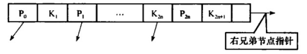
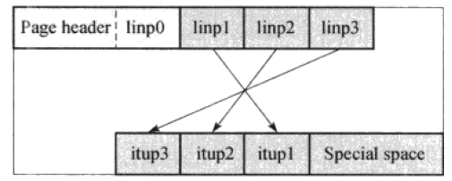
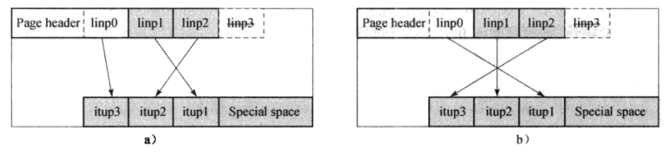
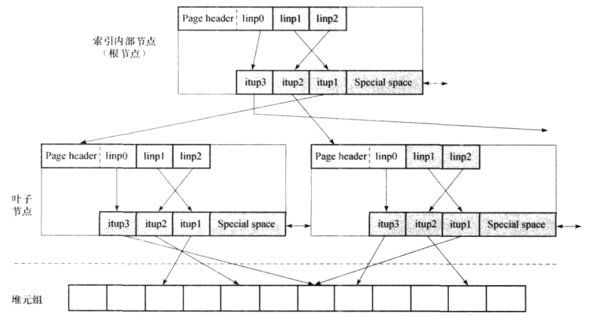
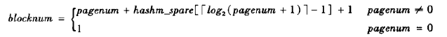
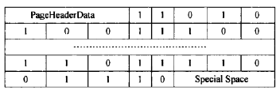
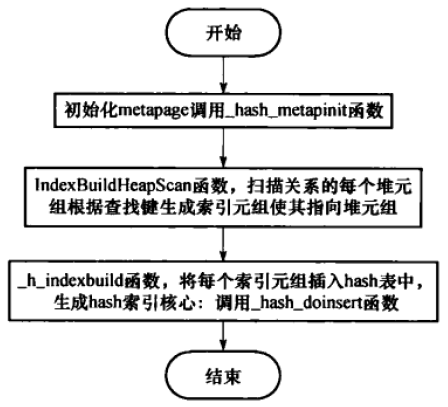
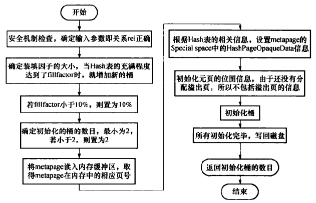
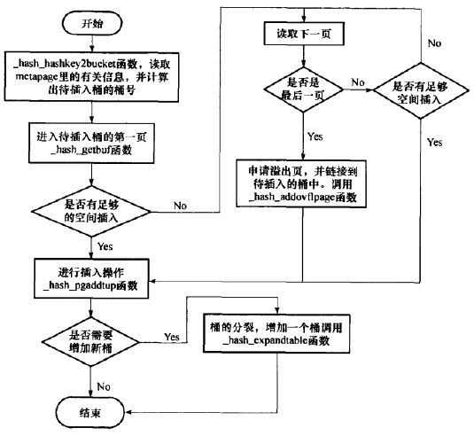

# 索引

- B-Tree索引
适合比较查询和范围查询，基于B+树建立索引，当使用(>,=,<,>=,<=)时优先考虑使用b+树。
- Hash索引
哈希表，只适用于简单的(=)比较。
- GiST索引
Generaized Search Tree通用技术搜索树 解释如下
> 通用搜索树是一棵平衡树，除根结点的扇出数在2和M之间外，每个节点的扇出数在kM和M之间，这里2/M<=k<=1/2。常量k称作该树的最小填充因子，M为一个结点可以容纳索引项的最大数目。索引项形式为（p，ptr），其中p是用作搜索码的谓词。在叶结点中，ptr为指向数据库中某一元组的指针；而在非叶结点中，ptr为指向其子树根结点的指针。谓词中可以包含自由变量，只要相应子树中叶结点标识的所有元组能实例化这些变量即可。

- GIN索引
Generalized Inverted Tree倒排索引
> 倒排索引源于实际应用中需要根据属性的值来查找记录。这种索引表中的每一项都包括一个属性值和具有该属性值的各记录的地址。由于不是由记录来确定属性值，而是由属性值来确定记录的位置，因而称为倒排索引(inverted index)。带有倒排索引的文件我们称为倒排索引文件，简称倒排文件
# 索引方式
- 唯一索引
UNIQUE修饰的关键字，只有B-Tree支持唯一索引
- 主键索引
主键有UNIQUE属性，是一种特殊的唯一索引
- 多属性索引
索引定义在多个属性上，就称作多属性索引，常用于多属性查询。B-Tree，GiST，GIN都支持。
- 部分索引
对表中一部分元组设立索引
```
CREATE INDEX stu_name_idx ON student(name) WHERE (id > 1 and id < 255);
```
- 表达式索引
只有使用相同的表达式时才能使用的索引。
默认都使用B-Tree
# 系统表
在PostgreSQL中，每种索引类型都在pg_am(access method)中用元组记录好了，其中包括该索引提供的访问函数。函数来源于pg_proc系统表中注册的函数。元组中还提供索引类型的一些特性，具体table内容如下。
## pg_am表

名称 | 类型 | 引用|说明
----|:------:|:----:|----
amname | name  | |索引类型名称
amstrategies | int2  ||支持的操作符类的数目
amssupport | int2  || 用于支持该索引的程序的数目
amcanorder|bool||是否支持有序扫描
amcanbackward|bool||是否支持逆向扫描
amcanunique|bool||是否支持唯一索引
amcanmultical|bool||是否支持多字段索引
amoptionlkey|bool||是否支持在第一个索引列上的无条件扫描
amindexnulls|bool||是否支持空索引
amsearchnulls|bool||是否支持IS NULL的搜索
amstorage|bool||是否支持索引存储的数据与列数据类型不同
amcluterable|bool||是否支持聚簇
amkeytype|odi|pg_type.oid|索引支持的数据类型
amnsert|regproc|pg_proc.oid|插入数据对应的函数
ambegincan|regproc|pg_proc.oid|扫描对应的函数
amgettuple|regproc|pg_proc.oid|获取下一个元组对应的函数
amgetbitmap|regproc|pg_proc.oid|获取所有有效元组
amrescan|regproc|pg_proc.oid|重新开始扫描
amendscan|regproc|pg_proc.oid|结束扫描
ammarkpos|regproc|pg_proc.oid|标记当前记录位置
amrestpos|regproc|pg_proc.oid|恢复已标记的位置
ambuild|regproc|pg_proc.oid|创建索引
ambulkdelete|regproc|pg_proc.oid|批量删除
amvacuumcleanup|regproc|pg_proc.oid|vacuum函数后的清理工作
amcostestimate|regproc|pg_proc.oid|估计一个扫描索引的代价
amoptions|regproc|pg_proc.oid|分析确定该索引的reloptions

## pg_index表
对于每一个创建的索引，除了会在pg_class表中新建一个元组，还会在pg_index表中新建一个元组

名称 | 类型 | 引用|说明
----|:------:|:----:|----
indexrelid|oid|pg_class.oid|该索引类型的oid
indrelid|oid|pg_class.oid|该索引对应的表的oid
indatts|int2||索引中的数行数
indisunique|bool||是否是唯一索引
indisprimary|bool||索引是否是主键
indisclutered|bool||是否在该索引上建立了聚簇
indisvaild|bool||该索引是否可以用于查询
indcheckxmin|bool||使用前是否需要检查xmin
indisready|bool||是否可以插入／修改
indkey|int2vector||基于表中哪些属性建立的索引
indclass|oidvector||表中属性对应的操作符
indoption|int2vector||索引中属性对应的标志值
indexprs|text||索引条件的表达式树
indpred|text||部分索引的表达式树

## pg_opclass
系统决定要使用某种索引，并不是由索引对应的表的属性决定的，而是有操作符所决定的，操作符对应的索引存储在pg_opclass表中。

名称 | 类型 | 引用|说明
----|:------:|:----:|----
opcmethod|oid|pg_am.oid|该操作符所对应的索引
opcname|name||操作符的名称
opcnamespce|oid|pg_namespace.oid|操作符所对应的命名空间
opcowner|oid|pg_authid.oid|操作符的主人？？？
opcfamily|oid|pg_family.oid|包含该操作符的集合
opcintype|oid|pg_type.oid|操作符对应的操作数
opcdefault|bool||操作符类型是否为缺省的
opckeytype|oid|pg_type.oid|索引的数据类型

## pg_opfamily表
上面说到操作符，这里提到的就是操作符的一个集合，按一定的属性分类。

名称 | 类型 | 引用|说明
----|:------:|:----:|----
opfmethod|oid|pg_am.oid|该操作符集所服务的索引
opfname|name||操作符集的名称
opfnamespace|oid|pg_namespace.oid|操作符集对应的命名空间
opfowner|oid|pg_authid.oid|操作符集作者

## pg_amop表
存储的每个索引的操作符集合和操作符之间的关系

名称 | 类型 | 引用|说明
----|:------:|:----:|----
amopfamily|oid|pg_opfamily|该操作符所属的操作符集
amopleftype|oid|pg_type.oid|左操作数类型
amoprighttype|oid|pg_type.oid|右操作数类型
amopstrategy|int2||操作符策略号
amopopr|oid|pg_operator.oid|操作符的oid
amopmethod|oid|oid|pg_am.oid|该操作符所服务的索引

## pg_amproc

每个操作符所对应的处理函数

名称 | 类型 | 引用|说明
----|:------:|:----:|----
amprocfamily|oid|pg_opfamily|该过程函数对应的操作符集
amproclefttype|oid|pg_type.oid|过程函数左输入
amprocrighttype|oid|pg_type.oid|过程函数右输入
amprocnum|int2||支持该过程的函数
amproc|oid|pg_proc.oid|函数对应的oid

> 以上是跟索引有关的系统表

# PostgreSQL中的B-Tree

- 这里使用的B树是优化过的B树，跟B+树比较类似，但不是真正意义上的B+树，特点如下：

1）在每个叶子节点中，设置了一个指向下一个兄弟节点指针，类似于B*树<br>
2）设置了一个K<sub>2n+1</sub>表示这个节点指向的所有节点中的最大值（HighKey），在以后的增删查改中会用到，以后讨论。
## 索引的组织结构

<center>



</center>

书上这个图画的比较渣，其中linp是指针，itup是元组索引，其实也就是关键字，linp0也就是上述所说到的HighKey，假设这个节点最多就装3个关键字，此时需要分裂，分裂过程如下：
1）若该节点不是是本层最右的节点，则需要：
```
把最大的关键字，也就是itup3复制到兄弟节点中
在这个节点中把itup3去掉，将linp0的值保存位itup3，因为此时在兄弟节点已经有了一份拷贝，这里可以删除节点仅保留值的范围从而节省一点空间
```
2）若该节点是本层最右的节点，则需要：
```
不需要保存最大的关键字，所以linp0当作普通节点的linp1使用。
```
<center>

<br></center>
图A为非最右节点的情况，而图B为最右节点的情况，整个树的结构如下图<br>

<center>

<br></center>

# PostgreSQL中的Hash索引

除了B树，Hash索引也是数据库中比较常用的一种索引，通过Hash表可以把键值分配到各个桶中，在PostgreSQl中使用的是动态Hash表，动态Hash表允许桶的数据进行改变，其中主要的两种动态Hash表分别为：

1）可扩展Hash表（在静态Hash表的结构上做了一些变化）：

- 为桶增加了一个间接层，就是说本来桶是一个大小固定的数组，而现在桶变成了一个指针，指向一个存储数据的空间，这样桶的大小就是可变的了。


2）线性Hash表

PostgreSQL中，桶的个数随着分裂次数的增加而增加，但是每次分裂后，所有增加的桶并不会立即使用，而只是使用需要存入元组的桶，其他新增的桶都被保留。这种方式能够有效的减少重新分配元组到桶中的工作量，提高效率。

## Hash索引实现细节

在PostgreSQL中，实现一个哈希索引需要使用到两张哈希表，其中一个是做索引的外存哈希表，另一个是用于内部数据查找的内存哈希表

<center>


</center>

哈希表中有上面图中包括的四个不同类型的页面，分别有元页，桶页，溢出页，位图页，下面我们对这四种结构分别进行分析。

### 元页

每个Hash索引都有一个元页，他是哈希索引的0号页（第一项），元页中包含

- 哈希的版本号 
- 哈希索引记录的索引元组数目
- 桶的信息
- 位图等相关信息

总而言之，元页记录了Hash索引的基本信息，每次对Hash索引操作后都要将元页读入内存进行更新。

### 桶页

Hash表由多个桶组成，每个桶则由一个桶页和若干个溢出页组成，每个桶的第一个页成为桶页，其他的页称作溢出页，整个桶的页组织是一个链式的结构，这样可以实现一个快速查找的效果。

在PostgreSQL中，桶页都是成组分配的，比如说一次分配0号桶和1号桶的桶页，所以在Hash初始化的时候，就存在有两个桶页，在PostgreSQL中，有一个参数叫做splitpoint，一开始splitpoint为0，在第一次桶页分裂时，splitpoint自增为1，并同时分配2～3号桶页，而当第二次分裂时，splitpoint自增到2，同时分配4～7页，同理，下一次分裂时，分配8～15号桶页，这样分配桶页，可以快速了解到各个桶是在哪一次分裂中产生的。

分裂时，新增加的桶并不是立即使用，比如说这次分配了4～7页，可能首先使用4号页，567留在下一次使用。

这样分配还有一个好处，可以很容易的求的页面在磁盘中的盘块号，使用下面的公式

<center>



</center>

### 溢出页

如果某个元组在它所属的桶里面放不下了，就需要给这个桶设置一个溢出页，溢出页和桶页之间使用双向链表连接起来。

在每次扩展Hash表后，都会给该次扩展预留一部分桶，即使这些桶尚未使用，所以分配的溢出页的磁盘号都是在预留的桶之后的。在元页中，有数组hashm_spares记录每次扩展桶时分配的溢出页数目，所以每个桶的磁盘块号也是很好计算的。而且，溢出页一旦分配，便一直存在，不会说中间有离散的未分配的磁盘号。

总而言之，溢出页就是桶页使用满后用于存放元组的页面。

### 位图

位图用于管理Hash索引的溢出页和位图本身的使用情况，就像我们上面所说的一样，我们不会回收分配的溢出页的物理空间，但是如果溢出页中没有数据了，我们也不能不使用这个溢出页，所以在这里我们使用位图对溢出页的使用状态进行管理。

在位图中，每一个溢出页和位图页都有一个比特位标识使用情况，0-可用，1-不可用，大致的格式如下：

<center>



</center>

那么上面的0和1是如何与溢出页对应的呢。在元页中的hashm_mapp数组中找到各个位图页的块号，然后我们首先找到位图页。每分配一个溢出页，在微凸页中就会有一个比特位与之对应，通过位图页中某一个比特位在该页数组中的下标，即可得出该位对应的溢出页页号，有如下公式：

<center>

对应溢出页的编号j = k * (每个位图页的大小) + i

</center>
因为溢出页一经分配不会回收，所以这样的对应关系不会改变，巧妙的实现了快速查找溢出页的功能。

## Hash索引的实现过程

Hash索引的实现过程主要分为以下几个步骤，Hash表的构建，索引元组的插入，溢出页的分配与回收，Hash的扩展，下面将针对这几个过程有关的函数进行分析。

### Hash表的构建

构建一个Hash索引时，首先要初始化该索引的元页、桶页以及位图页，之后调用扫描函数对待索引的表进行扫描，生成对应的索引元组，最后将这些索引元组插入到Hash表中。

PostgreSQL 8.4.1 使用全局变量来记录所创建的Hash索引，通过一个外部函数hashbuild来建立Hash索引，流程图如下:

<center>


<br></center>

对于上述涉及到的子函数，我们进一步分析：

- 第一个是_hash_metapinit函数，这个函数的作用为初始化元页，N个桶，以及一个位图，流程图如下：

<center>

</center>

值得一提的是，相对于其他程序，这个程度并没有锁的机制，在构建的过程中不存在死锁的情况发生。

- 第二个是IndexBuildHeapScan，这个函数扫描整个基表，对每一个元组都生成一个Hash索引元组病插入到Hash表中。

- hashbuildCallback，这个函数根据元组生成索引，可以说是IndexBuildHeapScan的一个子操作。

### 元组的插入

在元页的初始化后，在IndexBuildHeapScan函数中就进行了插入操作，用通俗的话来解释这个流程，就是说先计算出该索引元组应该插入的桶号，如果这个桶有足够的空间，则将该元组插入到该页当中，如果没有足够的空间，则申请一个溢出页并将元组插入到溢出页中，流程图如下：

<center>

</center>

其中涉及到一个核心函数，_hash_doinsert，这个是具体插入的函数，我们直接看它的流程：

<center>

</center>

以上过程因为不设计到改变原来元组的顺序问题，所以可以并发进行，对于一个很大的基表也可以在一个高效的情况下进行索引操作，可以说这个设计十分巧妙。
